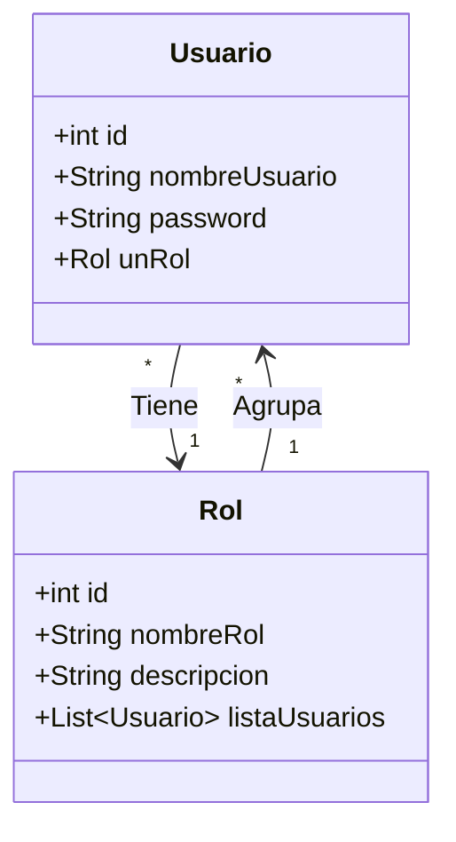

# 🔐 Sistema de Login en Java

Aplicación de escritorio para la autenticación y gestión de usuarios mediante roles. Permite el control de acceso diferenciado y la administración de credenciales, siguiendo el modelo de capas.

## 📋 Descripción

Este proyecto implementa un sistema completo de inicio de sesión (Login) donde se valida la identidad del usuario contra una base de datos MySQL.

Basedo en el enunciado (imágenes proporcionadas), el sistema cuenta con:

* **Autenticación**: Validación de usuario y contraseña.
* **Roles**: Diferenciación entre tipos de usuario (ej. Admin, Usuario Común) con permisos distintos.
* **Gestión de Usuarios**: (CRUD) Alta y edición de usuarios y sus roles.

## 💾 Modelo de Datos

El sistema se basa en dos entidades principales con una relación **1 a N** (Un rol puede tener múltiples usuarios).

> **Nota:** Un usuario solo tiene asignado un Rol a la vez.



## 🚀 Tecnologías

* **Java 17**: Lenguaje principal.
* **Java Swing**: Interfaz Gráfica.
* **JPA (Hibernate)**: Persistencia de datos.
* **MySQL**: Base de Datos.

## ⚙️ Configuración y Ejecución

1. **Base de Datos**:
    * Configura tu servidor MySQL local.
    * **Importante**: Revisa el archivo `persistence.xml` para configurar tus propias credenciales.

2. **Clonar Repo**:

    ```bash
    git clone https://github.com/dasafo/Login_Java.git
    cd Login_Java
    ```

3. **Compilar y Correr**:
    Ejecuta la clase principal desde tu IDE.

---
